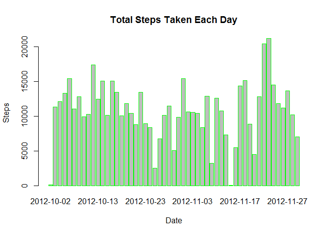
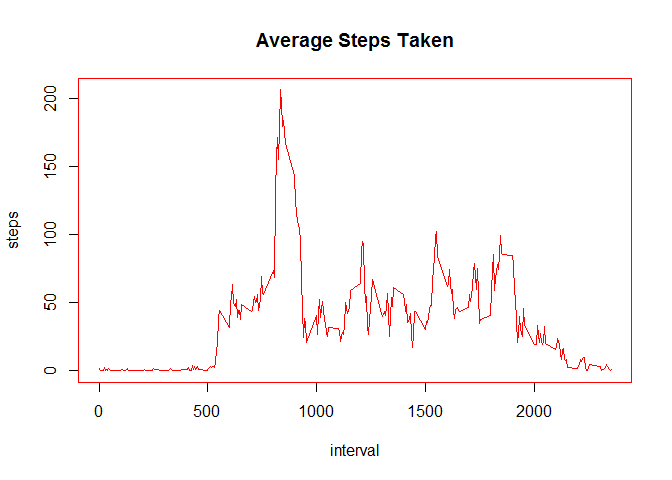
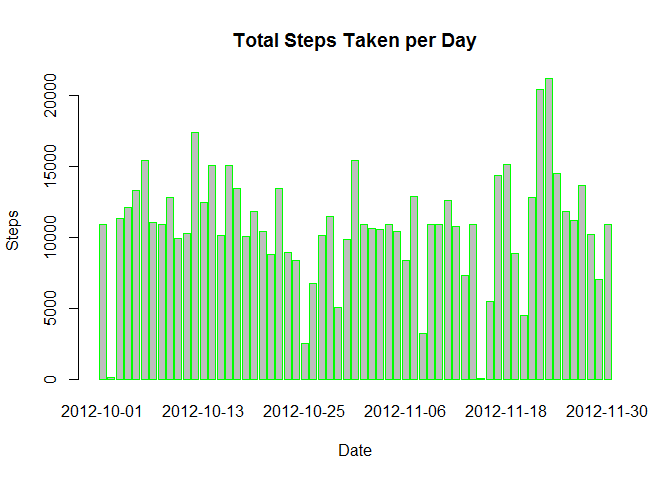

# Reproducible Research: Peer Assessment 1


## Loading and preprocessing the data
1. Load the data.

```r
data <- read.csv("activity.csv")
```

## What is the mean total number of steps taken per day?

1. Calculate the total number of steps taken per day and make a histogram.


```r
total_steps <- aggregate(steps ~ date, data=data, FUN=sum)
head(total_steps)
```

```
##         date steps
## 1 2012-10-02   126
## 2 2012-10-03 11352
## 3 2012-10-04 12116
## 4 2012-10-05 13294
## 5 2012-10-06 15420
## 6 2012-10-07 11015
```

2. Make a histogram of the total number of steps taken each day.


```r
barplot(
  total_steps$steps, 
  names.arg = total_steps$date, 
  main = "Total Steps Taken Each Day",
  xlab = "Date", 
  ylab = "Steps", 
  border = "green"
)
```

 

3. Calculate and report the **mean** and **median** total number of steps taken per day.


```r
#mean_steps <- aggregate(steps ~ date, data=data, FUN=mean)
#head(mean_steps)
mean_steps <- mean(total_steps$steps, na.rm = TRUE)
#median_steps <- aggregate(steps ~ date, data=data, FUN=median)
#head(median_steps)
median_steps <- median(total_steps$steps, na.rm = TRUE)
mean_steps
```

```
## [1] 10766
```

```r
median_steps
```

```
## [1] 10765
```

## What is the average daily activity pattern?

1. Make a time series plot (i.e. `type = "l"`) of the 5-minute interval 
   (x-axis) and the average number of steps taken, averaged across all 
   days (y-axis).


```r
interval_steps <- aggregate(steps ~ interval, data=data, FUN=mean)
par(pch=22, col="red")
plot(interval_steps, type="l", main="Average Steps Taken")
```

 

2. Which 5-minute interval, on average across all the days in the
   dataset, contains the maximum number of steps?


```r
interval_steps$interval[which.max(interval_steps$steps)]
```

```
## [1] 835
```


## Imputing missing values

1. Calculate and report the total number of missing values in the
   dataset (i.e. the total number of rows with `NA`s).


```r
sum(is.na(data$steps))
```

```
## [1] 2304
```

2. Devise a strategy for filling in all of the missing values in the
   dataset. The strategy does not need to be sophisticated. For
   example, you could use the mean/median for that day, or the mean
   for that 5-minute interval, etc.
   
3. Create a new dataset that is equal to the original dataset but 
   with the missing data filled in.


```r
stepVals <- data.frame(data$steps)
stepVals[is.na(stepVals),] <- ceiling(tapply(X=data$steps,
                                             INDEX=data$interval,
                                             FUN=mean,
                                             na.rm=TRUE
                                             )
                                      )
data_no_missing <- cbind(stepVals, data[,2:3])
colnames(data_no_missing) <- c("steps", "date", "interval")
head(data_no_missing)
```

```
##   steps       date interval
## 1     2 2012-10-01        0
## 2     1 2012-10-01        5
## 3     1 2012-10-01       10
## 4     1 2012-10-01       15
## 5     1 2012-10-01       20
## 6     3 2012-10-01       25
```

4. Make a histogram of the total number of steps taken each day and 
   Calculate and report the **mean** and **median** total number of steps 
   taken per day. Do these values differ from the estimates from 
   the first part of the assignment? What is the impact of inputting 
   missing data on the estimates of the total daily number of steps?


```r
steps_no_missing <- aggregate(steps ~ date, data=data_no_missing, FUN=sum)
barplot(
  steps_no_missing$steps, 
  names.arg = steps_no_missing$date, 
  main = "Total Steps Taken per Day", 
  xlab = "Date", 
  ylab = "Steps", 
  border = "green"
)
```

 

```r
mean_steps_nm <- mean(steps_no_missing$steps)
median_steps_nm <-median(steps_no_missing$steps)
```

**Mean total steps**

Mean missing data: 10766

Mean no missing data: 10785

Mean difference: 19

**Median total steps**

Median missing data: 10765

Median no missing data: 10909

Median difference: 144

##Are there differences in activity patterns between weekdays and weekends?

For this part the weekdays() function may be of some help here. 
Use the dataset with the filled-in missing values for this part.

1. Create a new factor variable in the dataset with two levels - "weekday" 
   and "weekend" indicating whether a given date is a weekday or weekend day.


```r
is_weekend <- function(date) {
  if (weekdays(as.Date(date)) %in% c('Saturday','Sunday'))
  {
    "weekend"
  }
  else
  {
    "weekday"
  }
}

data_no_missing$weekend <- as.factor(sapply(data_no_missing$date, is_weekend))

head(data_no_missing)
```

```
##   steps       date interval weekend
## 1     2 2012-10-01        0 weekday
## 2     1 2012-10-01        5 weekday
## 3     1 2012-10-01       10 weekday
## 4     1 2012-10-01       15 weekday
## 5     1 2012-10-01       20 weekday
## 6     3 2012-10-01       25 weekday
```

2. Make a panel plot containing a time series plot (i.e. type = "l") of 
   the 5-minute interval (x-axis) and the average number of steps taken, 
   averaged across all weekday days or weekend days (y-axis). See the 
   README file in the GitHub repository to see an example of what this 
   plot should look like using simulated data.


```r
interval_steps <- aggregate(steps ~ interval + weekend, 
                            data = data_no_missing, 
                            FUN = mean)
library("lattice")
xyplot(
    type = "l",
    data = interval_steps,
    steps ~ interval | weekend,
    xlab = "Interval",
    ylab = "Number of steps",
    layout = c(1,2)
)
```

 
